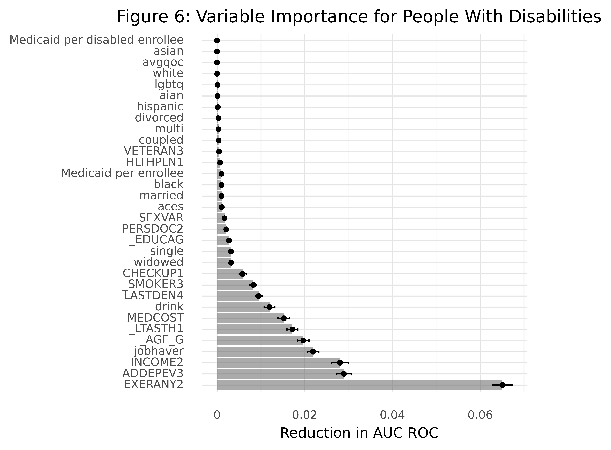
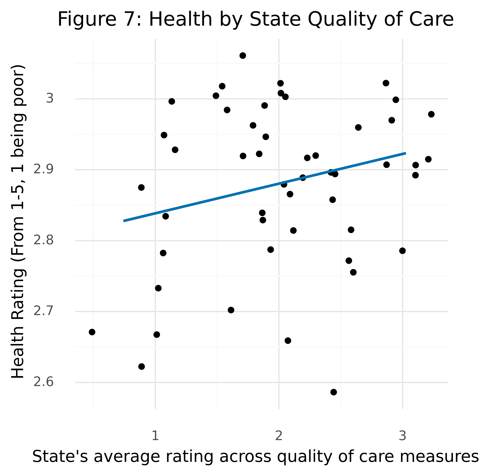
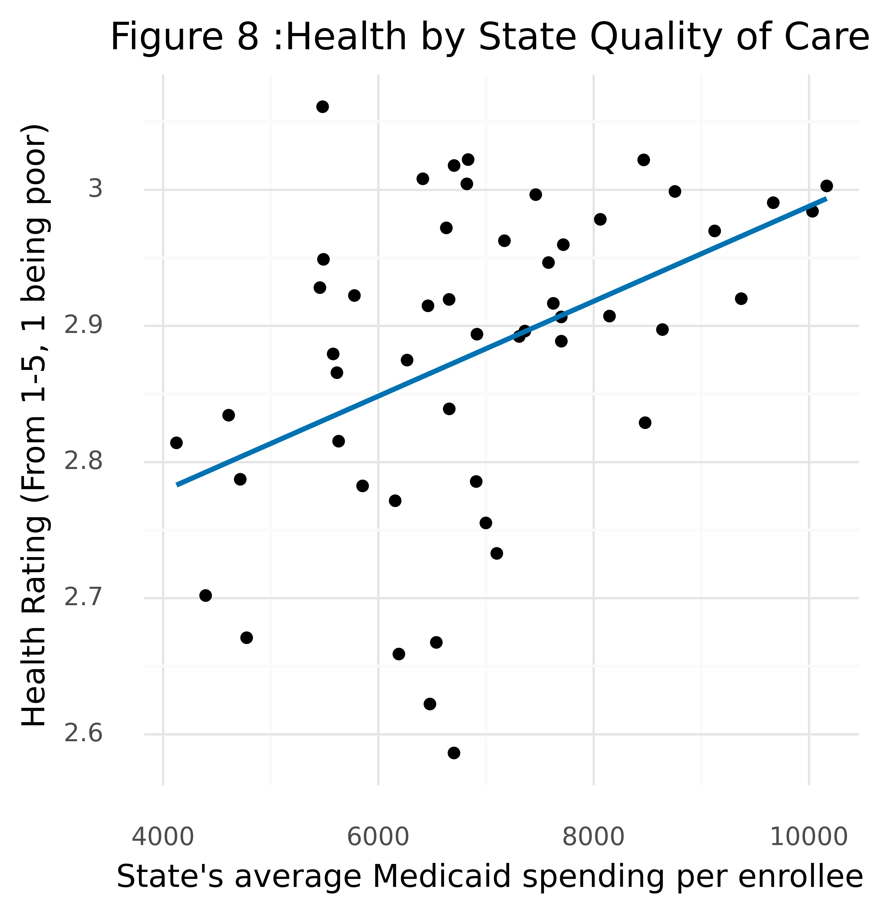

```{r setup, include=FALSE}

knitr::opts_chunk$set(echo = TRUE)
setwd("C:/Users/backd/final564")
getwd()
```
# Introduction


My goal in this project was to explore whether the factors which influence health, especially health behaviors and access to care, differ between people with and without disabilities, as well as the extent to which states’ Medicaid programs play a role in health for each group. This report includes background context on this topic, information on data and cleaning methods used, a description of the analysis process, and results with a discussion of their implications.


# Problem and Background


Issues of health equity have been pushed toward the forefront of public interest during the ongoing Covid-19 pandemic. While much needed attention has been paid to racial equity crises, there are significant disparities in access to and quality of health care for people with disabilities. In survey research I conducted for the State of Minnesota in 2020-21, I processed responses from hundreds of people with disabilities living in group or institutional settings describing how the healthcare system has failed them both in access to daily care and for more pressing health needs. This data presented a pressing question as to the extent to which these disparities impact people with disabilities in other environments, which factors cause these disparities, and how to remedy them.  

The CDC reports that people with disabilities typically have less access to health care, are less active, and engage more often in risky behavior^1^, and has multiple working initiatives to begin remedying these inequities. A key concern in working towards equity for people with disabilities lies in divisions between how to treat disabling conditions. The medical model, is that traditionally held by medical professionals and treats disability as a problem located within a person's body or brain^2^. The social model, however, views disability as being caused primarily by the way society and social structures are organized to prevent full access and inclusion^2^. Depending on which view of disability one takes, the causes solutions to health inequities for people with disabilities may look significantly different. 

# Data


There were two primary types of data used in this work: individual level data, including demographic and health-related factors, and state level data, which contained information on insurance rates, availability of doctors, and Medicaid spending and quality of care for each state and Washington DC.


## Individual-level


Data on individuals was pulled from the Centers for Disease Control and Prevention’s Behavioral Risk Factor Surveillance System (BRFSS)^3^. This is a national survey, conducted over the phone (including both mobile and landline phones) each year with non-institutionalized adults. I used data from 2019, as the most recent dataset prior to the start of the Covid-19 pandemic. This dataset included responses from over 418,000 adults across the United States. My variable of interest was self-reported health status, as rated on a 5 point scale ranging from poor to excellent. The distribution of responses among people with and without disabilities is displayed in Figure 1. 

<center>


<center>


While the BRFSS offers a wide range of health and demographic variables to use, I limited those included in my modeling. I used a wide range of demographic variables, including gender, race/ethnicity, veteran status, marital status, educational attainment, and income. I also included variables indicating whether the respondent reported having a disability, lived in a rural or urban area, had a job, or identified as LGBTQ+. All of these variables may impact health and access to care. 

In exploring access to healthcare, I included variables indicating how long it has been since the respondent saw a doctor or dentist, whether they had insurance, if they had at least one healthcare provider they considered their doctor, and if the cost of healthcare had ever deterred them from seeking help when they needed it. In terms of health behaviors, I used variables for exercise, smoking, and drinking alcohol. Finally, I included indicators for diagnoses of depression or asthma and a calculated variable indicating the number of Adverse Childhood Experiences an individual had experienced, as this is often correlated with long-term health outcomes. 

### Processing

After collecting data and identifying which variables to use in modeling, I cleaned and transformed several variables into more usable formats. For instance, rather than using individual identifiers such as “gay male,” “lesbian woman,” or “bisexual male,” I constructed a single dummy variable indicating whether the respondent self-identified as LGBTQ. I also converted the variable “PERSDOC” to a dummy variable indicating whether the person had one or more health providers they considered their doctor, rather than a categorical variable indicating the type of doctor they had. Similarly, I calculated a variable counting the number of Adverse Childhood Experiences a respondent reported from multiple questions on these experiences. In exploring health behaviors, I transformed the number of drinks a respondent reports having each week into a categorical variable indicating if the respondent had no drinks, was above the median number of drinks, or below the median number. One of my most important variables, the dummy variable indicating whether the respondent had indicated having a disability, was also calculated from multiple other variables. The BRFSS asks a series of questions regarding impairments which allows them to categorize disability, however, I combined these into a single indicator, the distribution of which is displayed in Figure 2. Most variables I used required some cleaning, as the BRFSS may use different numerical values to indicate missingness depending on the survey question.


<center>


<center>


## State-level

State level data was pulled from two sources. First, I gathered a series of quality of care measures for Medicaid in each state from Medicaid.gov^4^. Because the dataset was formatted with multiple rows for each state and one row per measure, I reformatted this into a wider dataset using one row for each state and representing measures as columns. I then assigned each state a 1-5 ranking in each of these measures, and averaged these ranks for each state to create a new variable indicating overall Medicaid quality of care in each state. I merged these values into the individual level dataset, creating a new column holding the average quality of care rating for each respondent’s state of residents. 

I also gathered data KFF^5^ on Medicaid spending. Similar to the quality of care measures, I merged the average state spending per Medicaid enrollee and per Medicaid enrollee with disabilities into the individual level dataset. 

## Limitations

Although this survey has significant reach, BRFSS data is limited for work on disability issues because it does not include people living in institutional settings. Many people with disabilities live in settings which serve to segregate them from their communities, and as a result, may have very different experiences and definitions of health from people surveyed by the BRFSS. Additionally, the BRFSS was unable to collect enough responses from New Jersey in 2019 to publish its data.


# Analysis

## Methods

My first step in analysis was to construct a machine learning pipeline using Scikit-learn^6^, a python tool built to facilitate a range of analysis methods. Creating a pipeline allowed me to run multiple models using consistent pre-processing and validation, which I used on three different datasets. 
This pipeline included a k-fold cross validation metric, in which the data run through the pipeline is split into “k” number of sections (10, in my pipeline). Tests are run multiple times on all but one of the data sections, with a different section left out each time. This gives a better measure of tests’ performance and can help reduce overfitting. My pipeline also included a pre-processing step, for which I used a Scikit-learn feature which standardizes data values between a minimum and maximum, making them easier for the models I used to process.

I included five different classification methods in my pipeline to find the model which is best equipped to explain changes in my outcome variable. The first of these, linear regression, is included as a basic and easily interpretable statistical method, although it may not achieve the same predictive ability as some of the machine learning methods included in the pipeline. My next method, decision trees, work by creating splits in the dataset based on different variables’ values with the goal of creating predictions with minimal errors. These tend to be effective when used with categorical outcomes and work well with data inconsistencies, although they tend to have less predictive power and higher variance than some other methods.Bagging, or bootstrapping, builds separate decision trees on different training sets and then averages predictions. It can be helpful in reducing variance in statistical methods, but the decision trees it builds are often highly correlated. The random forest method is similar to bagging, but in addition to using different subset of data to build each tree, it also uses a random sample of predictors to base its splits on. My final method, k-nearest neighbors, makes predictions about the outcome variable based on the outcomes for the “k” number of observations which are most similar to an observation we are trying to make a prediction about.

The metric I used to evaluate these methods was negative mean squared error. The best performing model is the model which minimizes mean squared error. Although the model uses negative mean squared error to evaluate methods, it is the test with the lowest absolute value mean squared error which provides the best fit. 

An essential piece in my analysis process was exploring variable influence to see how much my predictive models relied on certain variables for their predictions. While variable importance is often used to refine a model, for my work it was important in identifying differences in which variables best predict health for the two population groups I wanted to look at. Because I was unsure which model would prove to be the best predictor for my data, I used permutation importance as a model-agnostic method of testing this. This method permutes a single variable in the model to scramble its data and tests the predictive performance of the model given this new data, and repeats the process for each variable in the model. The more the model’s predictive power changes based on this permutation process, the more important we can expect the variable being permuted to be in predictions. I also used partial dependency and individual conditional expectation (ICE) plots to explore the impact of these most important variables on health. Partial dependency plots allowed me to explore interactions between some variables, while ICE plots allowed me to examine how the impact of these variables could be different across observations. 

## Process

I included a wide range of variables as I started modeling because my interests here are highly exploratory. Although there are many factors which can impact health, I was most interested in how these differ across people with and without disabilities. By including a relatively large number of variables in my models, I hoped to allow those differences to emerge through testing to see which variables had the greatest impact for each group. After beginning this work, however, I made some changes to the variables I included. While I had originally included several categorical variables indicating employment status, I later converted these into a single dummy variable indicating whether or not a person was employed due to a high correlation between disability status and some work categories.


# Results

After constructing my learning pipeline, I used it to make predictions based on three separate individual-level datasets. The first of these was a sample of all respondents to the BRFSS, followed by a sample of only respondents with disabilities, and a sample of only respondents who did not report a disability. Because a goal of this work was to identify which factors have the greatest impact on health for people with and without disabilities, I also focused on examining variable importance. 

## Predictive models

For all three datasets run through the pipeline, the most predictive model was a linear regression. This is somewhat surprising, as some other methods included in the pipeline offer much greater flexibility in modeling. Although all three samples were very similar in size (around 50,000 observations), the predictive abilities of the three models, as based on the mean squared error (MSE), varied widely. The model for people who did not report a disability had the lowest MSE at .69, implying moderate predictive capability, while the model containing responses from people both with and without disabilities had an MSE of .78, showing less predictive power. The model including only data for people with disabilities, however, had an MSE of only .97, implying little predictive capabilities at all. All three models were run through the same pipeline described above, so these high MSE scores imply that there are significant explanatory variables missing from this analysis. The .3 difference in MSE scores between the models for people with and without disabilities confirms that there are indeed differences in which factors influence health for each group and suggests that many of the variables which are important determinants of health for people with disabilities are not available in the BRFSS survey.

## Variable importance and dependencies 

After running these models, I ran variable permutations and created visualizations depicting the importance of each variable based on how much permitting them changed the area under the curve of the prediction model.

The first model I ran included a sample of all BRFSS respondents, regardless of disability status (Figure 3).

<center>


<center>


Disability had the largest impact on the model, with an AUC ROC score of .096. This supports that experiences of health and health systems are different for people based on disability status. Exercise (with a score of .035), age (.020), income (.019), and  depression (.18) were also among the top factors influencing health. I also constructed plots showing interactions between disability and the top three other factors (Figure 4). 

<center>


<center>


In each plot, disability appears to be a driving force, with lower scores for people with disabilities. These plots confirm what we might expect of these factors: exercise and higher incomes are associated with higher health ratings, while health ratings tend to decrease with age. 

In the model with only BRFSS respondents who did not report a disability the most important variables look very similar to the model for all respondents, as seen in Figure 5. 

<center>


<center>


This is somewhat unsurprising: because approximately a third of survey respondents reported a disability, we can expect that people without disabilities have greater weight in the overall model. The error bars on this plot are somewhat larger than the original, but not significantly so. 

Although the model containing only data from people who reported having a disability has some similarities in variable importance to the previous two, it also reveals some key differences (Figure 6). 

<center>



<center>


While age is a primary variable in the other two models, for people with disabilities it ranks only fifth in importance. Instead, exercise is the most important factor, with a .065 change AUC ROC. Depression diagnoses and income level play slightly larger roles here, with scores of around .28, but a significant change here is in the increased importance of having a job (.022). While we can expect having a job to be correlated with income, for this population it could also be connected to measures which are not included in this model, such as type of impairment. In my past work with the State of Minnesota, whether a person had a job was also correlated with factors such as connections to the community and how much control they had over their daily lives, two items which can also impact health. 

Another interesting factor in this model is how little importance Medicaid spending or quality had on overall health. To explore this further, I grouped data for people with disabilities by state, and plotted average health ratings for each state against the state’s quality of care ratings (Figure 7).

<center>



<center>


There appears to be some correlation between these measures, but the connection may not be very strong. A wide range of measures went into the construction of these quality ratings, so some may be less relevant to this population's experience, however, taken as a whole they may indicate which states have more responsive health structures.

When plotting these state averages for health score against Medicaid spending per enrollee, however, there appears to be a much more dramatic correlation (Figure 8).


<center>



<center>


Medicaid spending per enrollee emerged as low importance in the original model, and Medicaid spending per disabled enrollee was the variable ranked lowest in importance. This may be an area for further exploration, as these figures imply that Medicaid spending can play a measurable role in health.


# Discussion

The criteria for success laid out in my project proposal was to test for differences in health between people with and without disabilities, and to test the impact of Medicaid spending and quality of care on health. I believe I have successfully begun to explore these questions, although there is much more room to expand on this work. As described in the data limitations section, data from New Jersey was unavailable for this year; expanding this research across multiple years may be helpful in ensuring that there is enough data from each state to draw robust conclusions. A time series analysis was a method I had originally considered, as tracking changes in health over time may help reveal trends in access to and quality of care which are important determinants of health. Similarly, I had originally planned to explore these questions on a state level, using several years of data to give me a large enough sample to draw conclusions from. However, given the time limitations of this project, I was unable to include this analysis.

A different, but related and highly salient research question, is the extent to which health varies for individuals in institutionalized settings. Social determinants of health may play an especially large role here, and including more data on these in any further research will likely be helpful in pinpointing differences in health between people with and without disabilities.

##### Word Count: 3,000


# Resources Cited: 

1. Centers for Disease Control and Prevention. (2021, June 23). Health equity for people with disabilities. Centers for Disease Control and Prevention. Retrieved December 16, 2021, from https://www.cdc.gov/ncbddd/humandevelopment/health-equity.html 

2. Office of Developmental Primary Care. (n.d.). Medical and Social Models of Disability. Retrieved December 16, 2021, from https://odpc.ucsf.edu/clinical/patient-centered-care/medical-and-social-models-of-disability 

3. Centers for Disease Control and Prevention (CDC). Behavioral Risk Factor Surveillance System Survey Data. Atlanta, Georgia: U.S. Department of Health and Human Services, Centers for Disease Control and Prevention, 2019. https://www.cdc.gov/brfss/annual_data/annual_2019.html 

4. Medicaid. 2019 Child and Adult Health Care Quality Measures Quality. https://data.medicaid.gov/dataset/e36d89c0-f62e-56d5-bc7e-b0adf89262b8 

5. KFF’s State Health Facts. Data Source:  Preliminary CY 2019 Transformed Medicaid Statistical Information System (T-MSIS), “Medicaid Spending Per Enrollee (Full or Partial Benefit).” https://www.kff.org/medicaid/state-indicator/medicaid-spending-per-enrollee/?currentTimeframe=0&selectedDistributions=all-full-or-partial-benefit-enrollees--individuals-with-disabilities&sortModel=%7B%22colId%22:%22Location%22,%22sort%22:%22asc%22%7D#notes 

6. Scikit-learn: Machine Learning in Python, Pedregosa et al., JMLR 12, pp. 2825-2830, 2011.